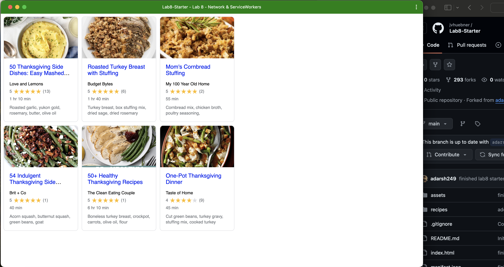

# Lab8-Starter

Jacqueline Huebner

[https://jvhuebner.github.io/Lab8-Starter](https://jvhuebner.github.io/Lab8-Starter)

## graceful degradation and service workers:
They are related concepts in web development. They are used for user experience and functionality when there are failures or lack of internet connection. Graceful degredation maintains a websites functionality even if there are some failures or the users devices don't support certain features. Service workers help to implement graceful degredatino by enabling offline capabilities. This will allow a website to function without internet connection. 

